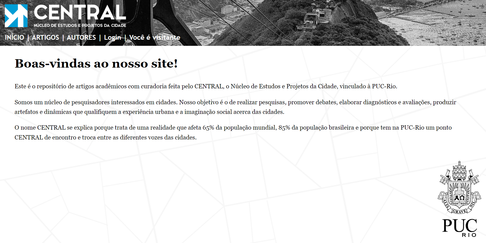
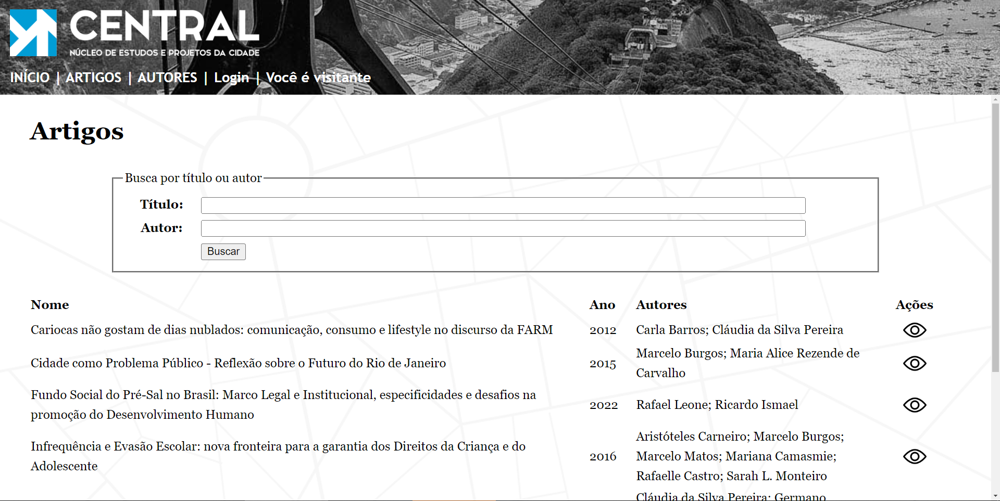
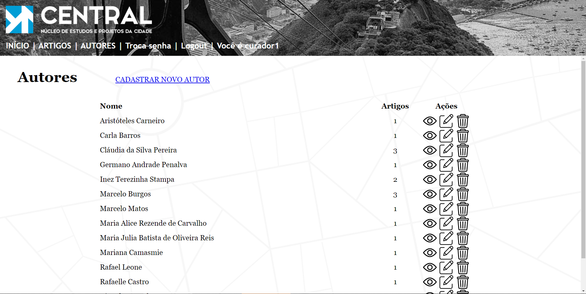

## Segundo Trabalho de Programação para Web de 2023/2

### Endereço do site
[https://central.dmnzs.com/](https://central.dmnzs.com/)

### Integrantes do grupo
- Daniel Menezes (1913037)
- Gabriel Banaggia (2010007)

### Escopo do site
Desenvolvemos para o trabalho do G2 um site para um núcleo de pesquisa
da própria PUC-Rio que se destina ao estudo das cidades, chamado CENTRAL.
A principal funcionalidade do site é armazenar títulos de artigos acadêmicos
voltados ao estudo de fenômenos ligados à pesquisa científica sobre cidades.

O site é voltado para dois perfis de usuário final distintos, que chamamos de
Visitantes e Curadores. Visitantes são usuários que não possuem ligação com
o núcleo de pesquisa e que acessam o site para obter informações a respeito
dos artigos aí cadastrados. Curadores são usuários com maior privilégio,
ligados ao núcleo de pesquisa e responsáveis pelo cadastro de artigos
acadêmicos (para o qual é preciso antes cadastrar também seus autores). Há
também a figura do usuário Administrador do site, que é seu responsável geral,
com acesso a todas as funcionalidades do site e dos seus bancos de dados.

### Manual do usuário com as funcionalidades do site

#### <u>Para Visitantes</u> (não há realização de login):
- Acesso ao site: Utilize o endereço acima no seu navegador preferido.
- Consulta aos artigos cadastrados: Clique no item ARTIGOS do menu principal,
disponível em qualquer uma das páginas do site, para visualizar os artigos
cadastrados. O movimento do mouse por cima de cada artigo ilumina a linha para
facilitar sua visualização. Caso o artigo tenha um link associado, é possível 
clicar no ícone de Visualização na extremidade direita da linha referente ao 
artigo, que abre o link do artigo em uma nova aba. Também é possível aplicar
filtros por trechos do título e do nome do autor do artigo. Para isso, basta
preencher os campos de filtro disponíveis acima da lista de artigos e clicar 
em buscar.
- Consulta aos autores cadastrados: Clique no item AUTORES do menu principal,
disponível em qualquer uma das páginas do site, para visualizar os autores
cadastrados. O movimento do mouse por cima de cada artigo ilumina a linha para
facilitar sua visualização. O clique no ícone de Visualização permite aplicar
um filtro para visualizar somente os artigos escritos por aquela pessoa.

#### <u>Para Curadores de conteúdo</u> (é necessário login):
- Funcionalidades disponíveis a Visitantes continuam acessíveis para Curadores.
Além disto, estes também podem realizar as atividades a seguir.
- Recuperação de senha: Clique no item LOGIN do menu principal, disponível em
qualquer uma das páginas do site enquanto não se estiver autenticado, e em
seguida clique na opção Esqueceu a senha?, indique seu e-mail para recuparação
da senha e siga as instruções na menagem que será recebida.
- Realização de login: Clique no item LOGIN do menu principal, disponível em
qualquer uma das páginas do site enquanto não se estiver autenticado, e envie
seus dados para autenticação. Após autenticação, ficam disponíveis as
funcionalidades abaixo.
- Cadastro de novos artigos: Antes de cadastrar um novo artigo, certifique-se
que seus autores já estão cadastrados na área correspondente (ver abaixo). Em
seguida, na área de ARTIGOS, clique na opção CADASTRAR NOVO ARTIGO, preencha
os campos com os dados necessários e aperte o botão para cadastrar um novo
artigo na base.
- Atualização de artigos cadastrados: Na área de ARTIGOS, clique no ícone de
Editar do artigo cujos dados se deseja alterar para realizar quaisquer
alterações desejadas, e aperte o botão para atualizar as informações inseridas.
- Remoção de artigos cadastrados: Na área de ARTIGOS, clique no ícone de Apagar
para ser levado a uma tela de confirmação onde é possível cancelar ou confirmar
a operação em questão.
- Cadastro de novos autores: Na área de AUTORES, clique na opção CADASTRAR NOVO
AUTOR, preencha os campos com os dados necessários e aperte o botão para 
cadastrar um novo autor na base.
- Atualização de autores cadastrados: Na área de AUTORES, clique no ícone de
Editar do autor cujos dados se deseja alterar para realizar quaisquer
alterações desejadas, e aperte o botão para atualizar as informações inseridas.
- Remoção de autores cadastrados: Na área de AUTORES, clique no ícone de Apagar
para ser levado a uma tela de confirmação onde é possível cancelar ou confirmar
a operação em questão.
- Encerrar sua sessão: Clique no item Sair do menu principal, disponível em
qualquer uma das páginas do site enquanto se estiver autenticado. Enquanto se
está autenticado, o último item do menu principal indica uma saudação ao 
usuário que inclui seu primeiro nome ou, na falta deste, seu nome de usuário.
- Trocar senha: Clique no item Trocar senha do menu principal, disponível em
qualquer uma das páginas do site enquanto se estiver autenticado, e preencha os
dados solicitados para a troca de senha.
- Editar perfil: Clique no item Editar perfil do menu principal, disponível em
qualquer uma das páginas do site enquanto se estiver autenticado, e atualize
os dados desejados.

#### <u>Para Administradores</u> (após login na área interna):
- Administração de todos os curadores do site: Esta funcionalidade é realizada
a partir da área de admin do site, e segue os padrões Django que são de
conhecimento dos administradores da página.
- Administração de todo o conteúdo do site e do banco de dados: Esta
funcionalidade também é realizada a partir da área de admin do site, e segue 
os padrões Django que são de conhecimento dos administradores da página.

### Testes realizados
Todas as funcionalidades do site passaram por testes de sanidade para uma 
garantia mínima de funcionamento. Apesar de ser recomendável, não houve tempo 
hábil para a realização de testes unitários de maneira mais abrangente e 
estruturada. De todo modo, com base nos testes realizados de forma menos
estruturada, todas as funcionalidades do site pareceram estar a contento.

### Exemplos de Imagens do Site
Tela de Início (visão visitante):

Tela de Artigos (visão visitante):

Tela de Autores (visão curador):

### Passos realizados para o deploy do site na AWS
1. Iniciar a máquina virtual IC2 na AWS
2. Ir em Configurações > Segurança > Editar regras inbound
3. Adicionar regra TCP custom e selecionar porta 8000
4. Verificar o IP público da máquina no dashboard
5. Adicionar o IP no ALLOWED_HOSTS do settings.py
6. Zipar a pasta do projeto
7. Copiar a pasta para a VM com scp
8. Acessar a VM com ssh
9. Criar o ambiente na VM com python, django e virtualenv
10. Criar uma sessão tmux para conseguir manter o servidor rodando
11. Rodar o servidor com: python3 manage.py 0.0.0.0:8000
12. Aperta Ctrl + b e depois d para jogar a sessão tmux para background
13. Fechar a conexão ssh

### Sobre AWS Free Tier
A Amazon oferece um plano gratuito por 12 meses para uso de vários serviços
básicos. Um desses serviços disponibiliza uma instância EC2, que pode ser 
iniciada com linux ou windows. A AWS solicita o cartão de crédito para 
utilizar até mesmo a versão gratuita, para cobrar caso haja utilização de 
recursos pagos. Link para a [AWS Free Tier](https://aws.amazon.com/free/).
